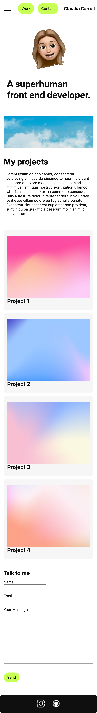
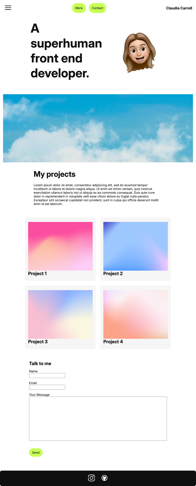
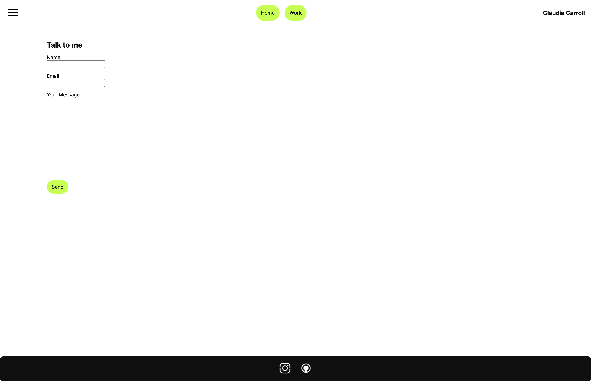

#  Claudia Carroll - Portfolio Task
​
[My portfolio site](ccarroll0102.github.io
)
​
## Project Requirements

### Content
In my website I have included a minimal colour pallete of greens, greys, black and white, with images of colour ful gradients to make the page pop! 

To keep things looking slick I chose to use my Bitmoji image of myself as my profile pic. I didnt have too much to say about myself at this stage of the process, so i've used lorem ipsum as the body content. 

So that things are interesting, ive also make the responsive padding for my article cards and text to be quite narrow. This makes it easy to view and read the content, as well as the block of body copy text. 

My contact form isnt anything interesting - ive just kept this simple and straight forward to not distract too much from other elements on the page. 

 Add a short paragraph describing the features below. What aesthetic and technical choices did you make? 
​
### Technical

I tried to keep things really simple in the technical design. The things i struggled with most was making the articles and the text responsive across different viewports. I relies alot on google and different articles to show me different methods of how to make things work. 

Playing around with things like flexfroggy also helped me make decisions for responsive design. Once I found a pattern that worked for one element, i applied the exact same for other alike elements. Something I learned is that there can be many ways to achieve one result, however the differences can lie in how clean the code looks at the end of the day. 
I also learned that I like repetitive code, that reuses semantics and patterns to build the end design. I find this easiest to read and build. 

### Bonus (optional)
I have applied a cute little drop shadow on hover over my buttons as well as a contrast adjustment over the images in the articles.
 
​
### Screenshots
> Home Page

> Contact Form

> Hover States

